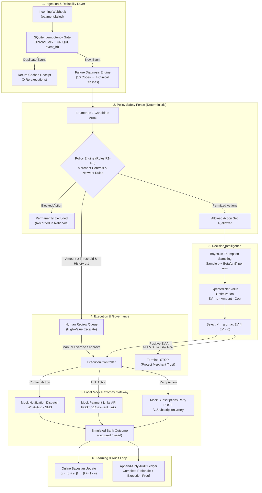
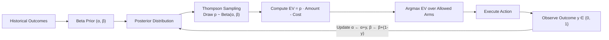
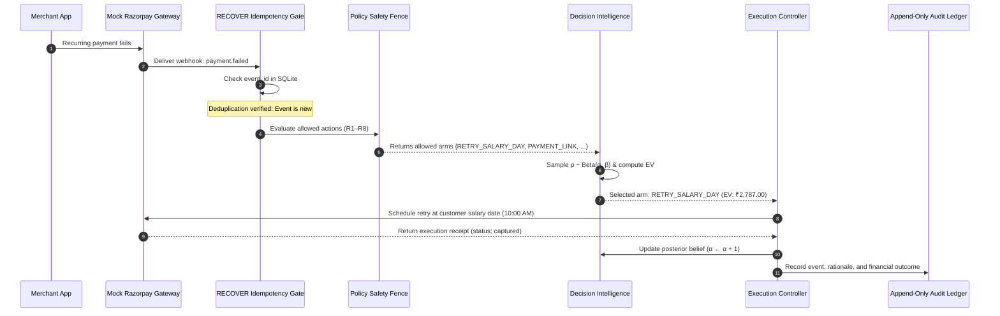
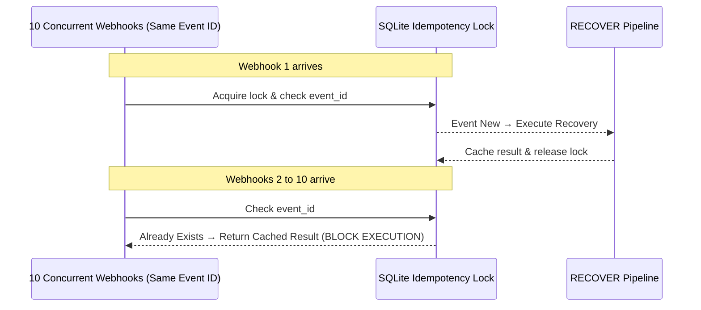
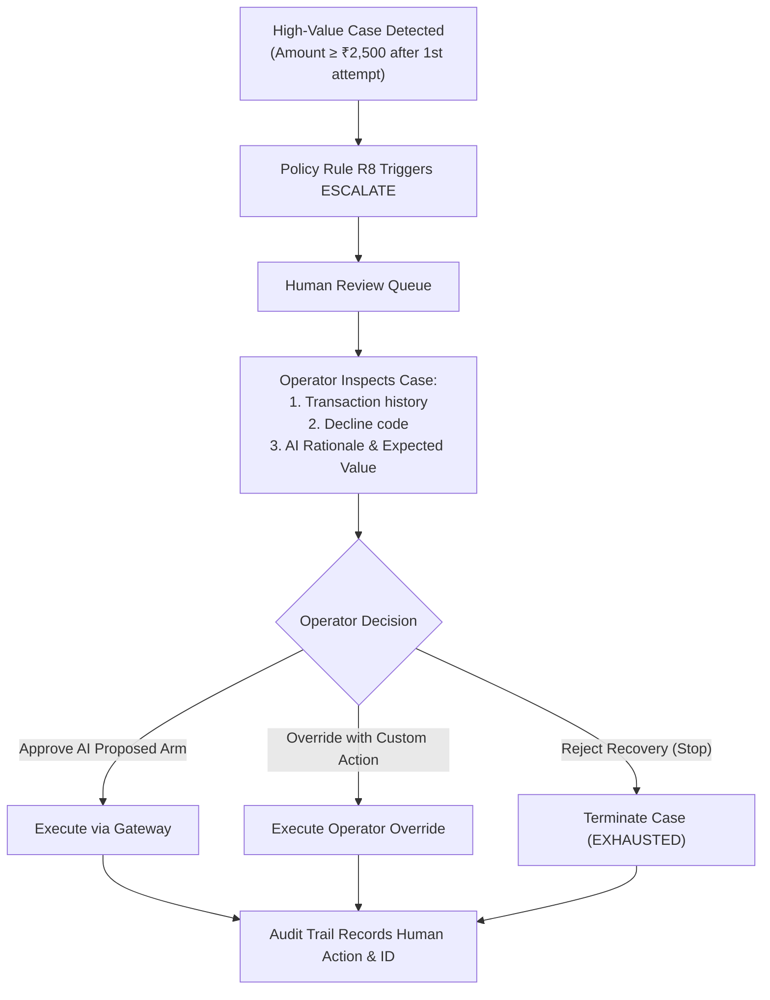
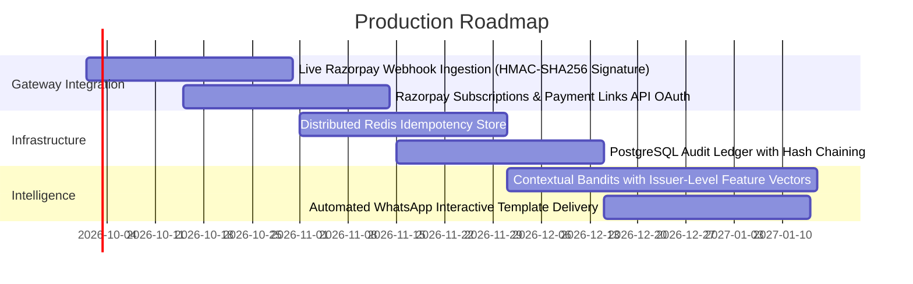

# RECOVER
### Policy-Bounded AI Revenue Recovery Engine

> **"Rules build the fence. AI chooses within the fence."**

RECOVER detects failed payments, diagnoses the underlying failure, evaluates policy-safe recovery actions, optimizes the next action using a Bayesian decision engine, executes through a local Mock Razorpay gateway, escalates high-risk cases to human operators, and records every decision in an append-only audit trail.

Built for **Razorpay Buildathon — Track 03: AI Revenue Recovery**.

---

> [!IMPORTANT]
> **Simulation Notice:** RECOVER uses a high-fidelity local Mock Razorpay environment for testing and demonstration. **Zero real money is moved, and zero live payment gateway credentials are required.** It runs 100% locally with zero external network dependencies.

---

## Table of Contents

- [1. Why RECOVER?](#1-why-recover)
- [2. Product Demo](#2-product-demo)
- [3. Key Results](#3-key-results)
- [4. System Architecture](#4-system-architecture)
- [5. Core Architecture Principles](#5-core-architecture-principles)
- [6. The Safety Fence (Deterministic Policy Engine)](#6-the-safety-fence-deterministic-policy-engine)
- [7. Decision Intelligence (Bayesian Thompson Sampling)](#7-decision-intelligence-bayesian-thompson-sampling)
- [8. End-to-End Recovery Workflow](#8-end-to-end-recovery-workflow)
- [9. Mock Razorpay & Local Gateway Integration](#9-mock-razorpay--local-gateway-integration)
- [10. Reliability & Idempotency Layer](#10-reliability--idempotency-layer)
- [11. Human-in-the-Loop Governance](#11-human-in-the-loop-governance)
- [12. Auditability & Explainability](#12-auditability--explainability)
- [13. Benchmark & Comparative Evaluation](#13-benchmark--comparative-evaluation)
- [14. Why This Is Different](#14-why-this-is-different)
- [15. Technology Stack](#15-technology-stack)
- [16. Project Structure](#16-project-structure)
- [17. Getting Started](#17-getting-started)
- [18. Judge Demo Walkthrough](#18-judge-demo-walkthrough)
- [19. Track 03 Alignment Matrix](#19-track-03-alignment-matrix)
- [20. What Broke & How We Recovered](#20-what-broke--how-we-recovered)
- [21. Limitations & Future Roadmap](#21-limitations--future-roadmap)
- [22. Summary](#22-summary)

---

## 1. Why RECOVER?

In recurring payment systems (UPI Autopay, e-Mandates, recurring cards, and netbanking), **payment failures are not all the same**:

* **A transient network error** (`ISSUER_UNAVAILABLE`, `UPI_TIMEOUT`) will often succeed if retried quickly after a short cooldown.
* **A revoked mandate or stolen card** (`MANDATE_REVOKED`, `CARD_LOST_STOLEN`) will **never** succeed on retry; reattempting it wastes gateway fees and violates payment network rules.
* **A UPI Autopay debit** requires an NPCI-mandated **24-hour pre-debit notification window** before re-presentment. Immediate retries violate regulatory compliance.
* **A high-value enterprise invoice** (e.g., ₹25,000) carries too much churn risk for automated retry bots; it demands structured human intervention with an explainable AI briefing.

### The Core Problem with Naive Dunning

Traditional recovery tools use static cron schedules (e.g., *"retry every 24 hours, 3 times"*). This blind approach causes:
1. **Network rule violations** by retrying terminal hard declines.
2. **Excessive gateway decline fees** on futile transactions.
3. **Customer churn** due to unexpected late-night debit notifications and message spam.
4. **Permanent revenue loss** on recoverable accounts that merely needed an alternative payment link or salary-day alignment.

### The RECOVER Paradigm

Instead of blindly retrying every failure, RECOVER executes a disciplined, multi-stage pipeline:

$$\text{Failure} \longrightarrow \text{Diagnosis} \longrightarrow \text{Policy Check} \longrightarrow \text{AI Decision} \longrightarrow \text{Execution} \longrightarrow \text{Outcome} \longrightarrow \text{Learning / Audit}$$

```
                ┌─────────────────────────────────────────────────────────┐
                │                     PAYMENT FAILURE                     │
                └────────────────────────────┬────────────────────────────┘
                                             │
                                             ▼
                ┌─────────────────────────────────────────────────────────┐
                │             DIAGNOSIS & FAILURE TAXONOMY                │
                │        10 Decline Codes → 4 Clinical Classes            │
                └────────────────────────────┬────────────────────────────┘
                                             │
                                             ▼
                ┌─────────────────────────────────────────────────────────┐
                │                   POLICY SAFETY FENCE                   │
                │         Deterministic Invariants (Rules R1 – R8)        │
                └────────────────────────────┬────────────────────────────┘
                                             │
                                             ▼
                ┌─────────────────────────────────────────────────────────┐
                │                  DECISION INTELLIGENCE                  │
                │       Bayesian Thompson Sampling on Allowed Arms        │
                │       Max Net Expected Value: EV = p · Amount - Cost    │
                └────────────────────────────┬────────────────────────────┘
                                             │
                                             ▼
                ┌─────────────────────────────────────────────────────────┐
                │                  EXECUTION CONTROLLER                   │
                │        Mock Razorpay Subscriptions / Payment Links      │
                │               or Human Review Escalation                │
                └────────────────────────────┬────────────────────────────┘
                                             │
                                             ▼
                ┌─────────────────────────────────────────────────────────┐
                │              OUTCOME OBSERVATION & AUDIT                │
                │     Online Posterior Update + Append-Only Ledger        │
                └─────────────────────────────────────────────────────────┘
```

---

## 2. Product Demo

🎥 **5-Minute Product Demo**  
[Watch the RECOVER Demo Video](https://youtu.be/DEMO_VIDEO_ID)  
*(Note: Replace `https://youtu.be/DEMO_VIDEO_ID` with the recorded demo recording URL before final submission)*

### Visual Interface Overview

RECOVER features a complete dual-console experience:
1. **Modern Full-Stack Dashboard:** A React 18 + TypeScript + Vite + Tailwind CSS single-page application communicating with a FastAPI backend.
2. **Streamlit Operations Console:** A single-process interactive Python dashboard (`app.py`) for rapid local inspection.

```
┌──────────────────────────────────────────────────────────────────────────────────────────────┐
│  RECOVER REVENUE OPERATIONS CONSOLE                                           ● API ONLINE   │
│  [Overview] [Case Explorer] [Decision AI] [Policy Safety] [Human Review] [Reliability Lab]   │
├──────────────────────────────────────────────────────────────────────────────────────────────┤
│  RECOVERY RATE      NET REVENUE RECOVERED      POLICY VIOLATIONS      REVENUE / ATTEMPT      │
│     79.5%               ₹5,67,299.11                   0                  ₹1,298.74          │
│   (+36.0 pp lift)      (+₹2,39,375.57 net)        (100% compliant)      (3.67× efficiency)   │
├──────────────────────────────────────────────────────────────────────────────────────────────┤
│  CASE EXPLORER — ACTIVE PIPELINE                                                             │
│  Case #1042 │ ₹4,500.00 │ UPI Autopay │ INSUFFICIENT_FUNDS │ Action: RETRY_SALARY_DAY        │
│  Why AI Chose This: p_hat=0.62, Cost=₹3.00, EV=₹2,787.00. Rule R2 deferred debit past 24h.   │
└──────────────────────────────────────────────────────────────────────────────────────────────┘
```

*Recommended screenshots to place in `docs/screenshots/` when packaging submissions:*
* `docs/screenshots/overview_dashboard.png` — High-level financial KPIs, recovery comparison, and pipeline volume.
* `docs/screenshots/case_explorer.png` — Case list with side-by-side explainability drawer ("Why AI Chose This").
* `docs/screenshots/decision_intelligence.png` — Real-time Beta posterior distributions and exploration-exploitation stats.
* `docs/screenshots/reliability_lab.png` — 10-duplicate webhook blast simulator and SQLite idempotency verification.
* `docs/screenshots/human_review.png` — High-value escalation queue with operator approve/reject controls.

---

## 3. Key Results

All performance metrics below are generated directly from the reproducible benchmark implementation in `recover/metrics.py` and `tests/test_metrics.py`.

### Benchmark Performance Comparison (n=400, Seed 42)

> **Label:** Controlled simulation benchmark — Seed 42  
> *Simulated, reproducible test run comparing RECOVER against a standard industry baseline (fixed 24-hour retries × 3). Not an empirical claim about live Razorpay production networks.*

| Metric | Naive Fixed Schedule | RECOVER (Policy + AI) | Net Impact / Lift |
|:---|:---:|:---:|:---:|
| **Recovery Rate** | 43.5% (174 / 400) | **79.5% (318 / 400)** | **+36.0 percentage points** |
| **Gross Recovered Revenue** | ₹3,30,728.54 | **₹5,68,848.61** | **+₹2,38,120.07 (+72.0%)** |
| **Gateway & Action Fees** | ₹2,805.00 | **₹1,549.50** | **-44.8% fee reduction** |
| **Net Revenue Recovered** | ₹3,27,923.54 | **₹5,67,299.11** | **+₹2,39,375.57 net profit** |
| **Total Retry Attempts** | 935 | **438** | **-53.2% fewer retries** |
| **Customer Messages Sent** | 0 | **177** | Multi-channel link rescue |
| **Revenue per Retry Attempt** | ₹353.72 | **₹1,298.74** | **3.67× higher efficiency** |
| **Cost to Recover ₹100** | ₹0.85 | **₹0.27** | **68.2% cost reduction** |
| **Policy Violations** | 168 | **0** | **100% compliant (0 violations)** |
| **High-Value Escalations** | 0 (blindly failed) | **20** | Active human safety net |
| **Exhausted / Unrecoverable** | 226 | **62** | **72.6% churn reduction** |

### Multi-Seed Statistical Confidence (10 Independent Seeds, n=400 each)

To prove that performance is statistically robust across varied customer cohorts rather than an artifact of a lucky seed, `recover.metrics.confidence()` evaluates 10 independent random seeds:

| Metric | RECOVER Mean ± Std | Naive Mean ± Std | Net Lift |
|:---|:---:|:---:|:---:|
| **Recovery Rate** | **81.40% ± 2.19%** | 44.75% ± 2.17% | **+36.65 ± 1.88 pp** |
| **Net Revenue Recovered** | **₹5,91,529.45 ± ₹33,491.88** | ₹3,10,879.96 ± ₹21,241.67 | **+₹2,80,649.49 ± ₹23,475.44** |
| **Policy Violations** | **0.0 ± 0.0** | 132.0 ± 28.04 | **Zero violations guaranteed** |
| **Total Retry Attempts** | **480.8 ± 21.6** | 948.0 ± 15.8 | **-49.3% retry reduction** |

---

## 4. System Architecture

RECOVER uses a decoupled, modular architecture where safety, intelligence, and execution are cleanly isolated.



---

## 5. Core Architecture Principles

| Layer | Implementation File | Primary Responsibility | Architectural Guarantee |
|:---|:---|:---|:---|
| **Failure Diagnosis** | `recover/simulator.py` | Maps raw issuer/gateway error codes into clinical failure categories (`SOFT`, `TRANSIENT`, `ACTION_REQUIRED`, `HARD`). | Eliminates guessing; isolates technical issues from permanent refusal. |
| **Policy Safety Fence** | `recover/policy.py` | Deterministically validates actions against regulatory, banking network, and merchant rules (R1–R8). | **Deterministic & testable.** Contains no randomness, no bandit, and zero LLM calls. |
| **Decision Intelligence** | `recover/decide.py` | Thompson Sampling multi-armed bandit optimizing Expected Net Value ($EV = p \cdot \text{amount} - \text{cost}$). | Only evaluates actions permitted by the Policy Engine. |
| **Execution Engine** | `recover/engine.py` | Priority event queue managing discrete time scheduling, retry gaps, and case lifecycle. | Guaranteed termination; zero infinite loops. |
| **Mock Razorpay** | `recover/mock_razorpay.py` | Local emulation of Razorpay APIs (recurring retries, payment links, webhooks). | 100% local, realistic payload structures, zero live network calls. |
| **Idempotency Gate** | `recover/mock_razorpay.py` | Thread-safe SQLite deduplication store protecting against burst webhooks. | At-most-once execution; exact deduplication. |
| **Human Review** | `recover/engine.py` + UI | High-value escalation queue enabling human operators to review, approve, or reject AI proposals. | Critical safety net for high-value accounts. |
| **Audit & Metrics** | `recover/metrics.py` | Append-only event log and statistical evaluation engine. | Complete decision explainability; zero unrecorded actions. |

---

## 6. The Safety Fence (Deterministic Policy Engine)

> *"AI never gets unrestricted authority over payment recovery."*

The foundational design principle of RECOVER is that machine learning models should **never** make direct regulatory or safety compliance decisions. Instead, deterministic code establishes strict operational boundaries, and AI is only permitted to choose among safe, compliant candidates.

```
                      Candidate Recovery Arms
                                │
                                ▼
                   ┌─────────────────────────┐
                   │  Policy Validation (R1) │── No ──► Disallowed (Hard Ban)
                   └────────────┬────────────┘
                                │ Yes
                                ▼
                   ┌─────────────────────────┐
                   │  Policy Validation (R2) │── No ──► Disallowed (Pre-Debit Window)
                   └────────────┬────────────┘
                                │ Yes
                                ▼
                   ┌─────────────────────────┐
                   │  Policy Validation (R3) │── No ──► Disallowed (Max Retries)
                   └────────────┬────────────┘
                                │ Yes
                                ▼
                    [All Rules R1–R8 Passed]
                                │
                                ▼
                    AI Evaluates & Ranks Arm
```

### The 8 Deterministic Rules (R1 – R8)

| Rule ID | Rule Name | Target Actions | Policy Condition | Invariant Enforced |
|:---|:---|:---|:---|:---|
| **R1** | **Hard Decline Ban** | All Retry Arms | `failure_class == "HARD"` | **Permanent ban.** Never retry hard declines (`MANDATE_REVOKED`, `CARD_LOST_STOLEN`, `RISK_DECLINE`). Protects merchant compliance. |
| **R2** | **UPI Pre-Debit Notice** | All Retry Arms | `method == "upi_autopay" and delay < 24h` | **Regulatory compliance.** Enforces NPCI mandate requiring a 24-hour pre-debit customer notification before re-presentment. |
| **R3** | **Max Retries Cap** | All Retry Arms | `case.retries >= max_retries` | **Gateway health.** Halts automated re-debits once merchant ceiling (default: 4) is reached, preventing bank penalization. |
| **R4** | **Minimum Retry Gap** | All Retry Arms | `(exec_time - last_retry) < min_gap` | **Cooldown enforcement.** Enforces minimum delay (default: 2 hours) between attempts to avoid duplicate decline fees. |
| **R5** | **Customer Contact Cap** | Contact Arms | `case.messages >= contact_cap` | **Anti-spam safeguard.** Caps total SMS and WhatsApp communications (default: 2) to protect customer goodwill. |
| **R6** | **Quiet Hours Deferral** | Contact Arms | `hour in 21:00..09:00` | **Consumer protection.** Never texts customers at night; automatically defers outreach dispatch to 09:00 next morning. |
| **R7** | **Recovery Window** | All except STOP | `age_days > recovery_window_days` | **Lifecycle termination.** Automatically stops automated actions on stale invoices past the merchant window (default: 30 days). |
| **R8** | **High-Value Escalation** | `ESCALATE` | `amount >= threshold and retries >= 1` | **Human governance.** Automatically routes high-value invoices (≥ ₹2,500 default) to human operators after first failed retry. |

### Architectural Boundary Proof
To prove this boundary is impenetrable, `tests/test_boundaries.py` runs an automated **AST static analysis** over the codebase. It programmatically asserts that neither `recover/policy.py` nor `recover/decide.py` contains any references to hidden ground-truth simulation variables (`hidden_recovery_prob`, `responsiveness`).

---

## 7. Decision Intelligence (Bayesian Thompson Sampling)

Once the Policy Safety Fence identifies the allowed action set $\mathcal{A}_{\text{allowed}}$, RECOVER uses an online **Bayesian Multi-Armed Bandit** to select the optimal recovery action.

### Mathematical Formulation

#### 1. Conjugate Beta Prior
For each failure class $c \in \{\text{SOFT}, \text{TRANSIENT}, \text{ACTION\_REQUIRED}, \text{HARD}\}$ and candidate arm $a \in \mathcal{A}$, the model maintains a conjugate Beta prior over the unknown conversion probability $\theta_{c, a}$:

$$\theta_{c, a} \sim \text{Beta}(\alpha_{c, a}, \beta_{c, a})$$

Informed priors reflect domain knowledge (e.g., transient gateway timeouts have higher baseline retry recovery than expired cards):

```python
# recover/decide.py
PRIORS = {
    ("TRANSIENT", "RETRY_2H"): (6, 2),          # High confidence in rapid recovery
    ("SOFT", "RETRY_SALARY_DAY"): (5, 3),       # High conversion on payroll dates
    ("ACTION_REQUIRED", "PAYMENT_LINK"): (4, 4), # Higher yield via link rescue
    ("HARD", "PAYMENT_LINK"): (2, 6),           # Unlikely, but possible link fallback
}
```

#### 2. Thompson Sampling (Exploration vs Exploitation)
At decision time, the engine draws a random sample from the current posterior distribution for every legally permitted arm:

$$p_a \sim \text{Beta}(\alpha_{c, a}, \beta_{c, a}) \quad \forall a \in \mathcal{A}_{\text{allowed}}$$

#### 3. Net Expected Value Optimization
Instead of maximizing raw conversion probability, RECOVER optimizes for **Net Revenue Yield** by accounting for transaction value ($A$) and execution fee ($\text{Cost}(a)$):

$$\text{EV}_a = p_a \cdot A - \text{Cost}(a)$$

* Example Action Costs:
  * Gateway Re-debit Retry: ₹3.00
  * WhatsApp Payment Link: ₹1.50
  * SMS Reminder: ₹0.50
  * Human Escalation: ₹0.00 (labor budgeted separately)

The engine selects:

$$a^* = \arg\max_{a \in \mathcal{A}_{\text{allowed}}} \text{EV}_a \quad \text{subject to } \text{EV}_{a^*} > 0$$

If no legal action yields a positive Expected Net Value, the case is safely routed to `ESCALATE` (if eligible under R8) or terminated with `STOP` to protect merchant resources.

#### 4. Bayesian Online Learning
When the Mock Razorpay payment outcome $y \in \{0, 1\}$ is observed, the posterior belief is immediately updated:

$$\alpha_{c, a^*} \longleftarrow \alpha_{c, a^*} + y$$

$$\beta_{c, a^*} \longleftarrow \beta_{c, a^*} + (1 - y)$$

* **Posterior Mean:** $\mathbb{E}[\theta] = \frac{\alpha}{\alpha + \beta}$
* **Uncertainty (Standard Deviation):** $\sigma = \sqrt{\frac{\alpha \beta}{(\alpha + \beta)^2 (\alpha + \beta + 1)}}$



> **Note on LLM Usage:** Decision-making in RECOVER is purely Bayesian bandit optimization. An LLM (Google Gemini 1.5 Flash via `recover/outreach.py`) is used exclusively for tone and phrasing adjustments of customer outreach messages, subject to strict deterministic regex guardrails that forbid alteration of payment amounts, links, or terms.

---

## 8. End-to-End Recovery Workflow



---

## 9. Mock Razorpay & Local Gateway Integration

RECOVER is architected around a clean gateway abstraction implemented in `recover/mock_razorpay.py`. It behaves identically to Razorpay's recurring billing and payment link APIs without initiating external network calls.

### Implemented Endpoints & Simulated Payloads

| Action | Mock Method | Emulated Razorpay API | Simulated Response Payload |
|:---|:---|:---|:---|
| **Recurring Debit Retry** | `MockRazorpay.retry_payment()` | `POST /v1/subscriptions/{id}/retry` | `{"id": "pay_mock_...", "entity": "payment", "status": "captured"\|"failed", "amount": 249900, "currency": "INR", "method": "card", "simulated": true}` |
| **Payment Link Creation** | `MockRazorpay.create_payment_link()` | `POST /v1/payment_links` | `{"id": "plink_mock_...", "entity": "payment_link", "status": "created", "short_url": "https://mock.razorpay.local/plink/...", "simulated": true}` |
| **Recovery Notification** | `MockRazorpay.send_recovery_notification()` | `POST /v1/notifications` | `{"id": "notif_mock_...", "entity": "notification", "channel": "whatsapp", "status": "sent", "simulated": true}` |
| **High-Value Escalation** | `MockRazorpay.escalate_payment()` | Internal Ops / Webhook | `{"id": "pay_mock_...", "status": "escalated_to_human", "reason": "...", "simulated": true}` |

### Webhook Event Schema

RECOVER processes canonical Razorpay `payment.failed` webhook structures:

```json
{
  "entity": "event",
  "account_id": "acc_mock_merchant_001",
  "event_id": "evt_mock_8f9a0b1c2d3e",
  "event": "payment.failed",
  "event_type": "payment.failed",
  "payment_id": "pay_mock_3c4d5e6f7a8b",
  "amount": 2499.00,
  "method": "card",
  "error_code": "INSUFFICIENT_FUNDS",
  "timestamp": 1725541200,
  "payload": {
    "payment": {
      "entity": {
        "id": "pay_mock_3c4d5e6f7a8b",
        "amount": 249900,
        "currency": "INR",
        "status": "failed",
        "method": "card",
        "error_code": "INSUFFICIENT_FUNDS",
        "error_description": "Payment failed due to INSUFFICIENT_FUNDS",
        "error_source": "issuing_bank",
        "error_step": "payment_authorization",
        "error_reason": "insufficient_funds",
        "created_at": 1725541200
      }
    }
  },
  "simulated": true
}
```

---

## 10. Reliability & Idempotency Layer

In distributed payment recovery systems, duplicate webhook delivery is an inevitable reality caused by network timeouts, gateway re-deliveries, and concurrent worker threads. Without strict idempotency, recovery engines trigger **duplicate charges, duplicate SMS messages, and race conditions**.

RECOVER includes a production-grade, thread-safe `IdempotencyStore` built on local SQLite:
* **Storage Schema:** `webhook_idempotency` table with a `PRIMARY KEY` on `event_id`.
* **Locking Mechanism:** Python `threading.Lock()` combined with SQLite `BEGIN IMMEDIATE` atomic transactions.

### Verified 10-Duplicate Webhook Burst Test

The reliability test suite (`tests/test_mock_razorpay.py:test_ten_duplicate_events_cause_exactly_one_execution`) verifies this behavior:



| Verification Parameter | Measured Result | Production Invariant |
|:---|:---:|:---|
| **Incoming Webhook Events** | **10** | Identical payload with duplicate `event_id` |
| **Pipeline Executions** | **1** | Processed through Policy and Decision layers |
| **Duplicate Events Blocked** | **9** | Intercepted at idempotency gate |
| **Duplicate Charges / Re-attempts** | **0** | Zero duplicate gateway calls |
| **Idempotency Violations** | **0** | Perfect deduplication guarantee |

---

## 11. Human-in-the-Loop Governance

RECOVER enforces human governance over high-risk or high-value recovery actions rather than allowing full autonomy.



### Why This Matters
For subscription merchants, an accidental aggressive retry on a ₹50,000 enterprise annual contract can cause an immediate customer dispute or contract cancellation. RECOVER treats human review as a first-class citizen: the AI prepares the diagnosis, calculates expected conversion values, and presents an actionable recommendation for human sign-off.

---

## 12. Auditability & Explainability

Every decision made by RECOVER produces an immutable audit record. The system never executes a recovery step without persisting a complete audit receipt.

### Actual Audit Ledger Fields

```json
{
  "seq": 42,
  "kind": "action",
  "policy": "smart",
  "decided_at": 14,
  "executed_at": 38,
  "case_id": 1042,
  "arm": "RETRY_SALARY_DAY",
  "failure_class": "SOFT",
  "method": "upi_autopay",
  "amount": 3499.00,
  "success": 1,
  "violation": 0,
  "violation_reasons": [],
  "deferred": false,
  "rationale": {
    "case_id": 1042,
    "decided_at": 14,
    "failure_class": "SOFT",
    "method": "upi_autopay",
    "amount": 3499.00,
    "chosen": "RETRY_SALARY_DAY",
    "chosen_ev": 2183.88,
    "chosen_sampled_p": 0.625,
    "considered": [
      {
        "arm": "RETRY_2H",
        "allowed": false,
        "reason": "UPI Autopay: 24h pre-debit notification required before re-presentment",
        "sampled_p": null,
        "cost": 3.0,
        "ev": null
      },
      {
        "arm": "RETRY_24H",
        "allowed": true,
        "reason": "ok",
        "sampled_p": 0.25,
        "cost": 3.0,
        "ev": 871.75
      },
      {
        "arm": "RETRY_SALARY_DAY",
        "allowed": true,
        "reason": "ok",
        "sampled_p": 0.625,
        "cost": 3.0,
        "ev": 2183.88
      }
    ],
    "why_chosen": "RETRY_SALARY_DAY selected: highest positive expected value (EV=₹2183.88) among allowed actions."
  }
}
```

---

## 13. Benchmark & Comparative Evaluation

### Visual Comparison

```text
RECOVERY RATE
RECOVER   ████████████████████████████████ 79.5%
Naive     █████████████████ 43.5%
          +36.0 percentage points lift

RETRY ATTEMPTS (LOWER IS BETTER)
RECOVER   ████████████ 438 attempts
Naive     █████████████████████████ 935 attempts
          -53.2% fewer gateway attempts

POLICY VIOLATIONS (LOWER IS BETTER)
RECOVER   0 violations (100% compliant)
Naive     ████████ 168 violations
```

### Multi-Seed Benchmark Data (n=400 per seed)

| Seed | RECOVER Rate | Naive Rate | Rate Lift | RECOVER Net (₹) | Naive Net (₹) | Net Lift (₹) | RECOVER Violations | Naive Violations |
|:---:|:---:|:---:|:---:|:---:|:---:|:---:|:---:|:---:|
| **0** | 86.00% | 46.00% | +40.00 pp | ₹6,73,396.92 | ₹3,39,595.27 | +₹3,33,801.65 | **0** | 111 |
| **1** | 80.25% | 44.00% | +36.25 pp | ₹5,83,539.36 | ₹3,02,201.11 | +₹2,81,338.25 | **0** | 141 |
| **2** | 79.25% | 44.75% | +34.50 pp | ₹5,79,380.15 | ₹2,99,496.04 | +₹2,79,884.11 | **0** | 117 |
| **3** | 80.75% | 43.00% | +37.75 pp | ₹5,42,494.28 | ₹2,91,777.52 | +₹2,50,716.76 | **0** | 153 |
| **4** | 82.00% | 47.25% | +34.75 pp | ₹5,79,579.47 | ₹3,14,096.62 | +₹2,65,482.85 | **0** | 102 |
| **5** | 79.00% | 41.75% | +37.25 pp | ₹5,90,176.15 | ₹3,00,978.49 | +₹2,89,197.66 | **0** | 198 |
| **6** | 83.50% | 46.00% | +37.50 pp | ₹6,08,747.10 | ₹3,52,621.17 | +₹2,56,125.93 | **0** | 129 |
| **7** | 80.75% | 46.50% | +34.25 pp | ₹5,98,416.60 | ₹3,22,252.32 | +₹2,76,164.28 | **0** | 138 |
| **8** | 79.75% | 41.25% | +38.50 pp | ₹5,77,265.57 | ₹2,79,531.03 | +₹2,97,734.54 | **0** | 120 |
| **9** | 82.75% | 47.00% | +35.75 pp | ₹5,82,298.90 | ₹3,06,250.04 | +₹2,76,048.86 | **0** | 111 |
| **Mean** | **81.40%** | **44.75%** | **+36.65 pp** | **₹5,91,529.45** | **₹3,10,879.96** | **+₹2,80,649.49** | **0** | **132** |

---

## 14. Why This Is Different

| Dimension | Traditional Dunning Bots | RECOVER |
|:---|:---|:---|
| **Action Selection** | Static timer (e.g., fixed every 24h) | Context-aware Bayesian Multi-Armed Bandit (Thompson Sampling) |
| **Failure Diagnosis** | Treats all payment failures identically | 10-code clinical taxonomy mapped into 4 distinct recovery classes |
| **Safety Governance** | Blind re-debit attempts | **Deterministic Policy Fence (R1–R8)** enforcing network compliance |
| **Regulatory Guardrails** | Violates NPCI 24h notice & hard decline rules | **Zero-violation guarantee** enforced prior to AI evaluation |
| **Optimization Target** | Maximizes raw retry count | Maximizes Net Expected Value ($EV = p \cdot \text{Amount} - \text{Cost}$) |
| **Duplicate Delivery** | Vulnerable to double debits on webhook bursts | SQLite Idempotency Gate with atomic thread synchronization |
| **High-Value Exposure** | Automated failure triggers unmonitored churn | Human-in-the-Loop review queue with explainable rationale |
| **Explainability** | Black-box automated scripts | Full audit ledger storing per-arm evaluation and rejection reasons |

---

## 15. Technology Stack

### Frontend (Modern React Console)
* **Framework:** React 18 with TypeScript
* **Build Tool:** Vite 5
* **Styling:** Tailwind CSS + PostCSS
* **Icons:** Lucide React
* **Alternative Console:** Streamlit 1.32+ (`app.py`) for single-process local Python runs

### Backend (REST API Server)
* **Framework:** FastAPI 0.115+
* **ASGI Server:** Uvicorn
* **Data Validation:** Pydantic v2
* **HTTP Client:** HTTPX (for test client operations)

### AI & Decision Intelligence
* **Core Algorithm:** Bayesian Multi-Armed Bandit (Beta-Bernoulli Thompson Sampling)
* **Prior/Posterior Modeling:** Conjugate Beta distributions ($p \sim \text{Beta}(\alpha, \beta)$)
* **Outreach Rewriting (Optional):** Google Generative AI (`gemini-1.5-flash`) with regex guardrails

### Data & Persistence
* **Idempotency Store:** Local SQLite (`recover_idempotency.db`) with atomic transactions
* **Data Processing:** Pandas 2.0+
* **In-Memory State Engine:** Discrete-event priority queue (`heapq`)

### Testing & Verification
* **Test Runner:** Pytest 7.4+
* **Code Isolation:** AST Static Analysis (`tests/test_boundaries.py`)
* **Total Automated Tests:** 71 passed tests (59 core engine + 12 backend API)

---

## 16. Project Structure

```text
.
├── backend/                        # FastAPI REST backend server
│   ├── main.py                     # API routers, endpoints, and CORS setup
│   ├── schemas.py                  # Pydantic v2 response and request schemas
│   ├── state.py                    # Shared in-memory simulation state holder
│   └── tests/                      # Backend API test suite (12 tests)
│       └── test_api.py             # End-to-end endpoint verification
├── frontend/                       # React 18 + Vite + Tailwind CSS dashboard
│   ├── src/
│   │   ├── api/client.ts           # Type-safe fetch client for backend API
│   │   ├── components/             # Reusable UI cards, banners, modal dialogs
│   │   ├── pages/                  # 10 dedicated view pages
│   │   │   ├── OverviewPage.tsx    # High-level KPIs and recovery comparisons
│   │   │   ├── CaseExplorerPage.tsx# Case filter table & explainability drawer
│   │   │   ├── DecisionIntelligencePage.tsx # Thompson Sampling beliefs & priors
│   │   │   ├── PolicySafetyPage.tsx# Interactive rule controls (R1–R8)
│   │   │   ├── HumanReviewPage.tsx # High-value escalation queue & approval
│   │   │   ├── ReliabilityLabPage.tsx # 10-duplicate blast & idempotency metrics
│   │   │   ├── AuditTrailPage.tsx  # Append-only ledger & CSV export
│   │   │   ├── ExperimentPage.tsx  # Multi-seed benchmark comparisons
│   │   │   ├── FailureTaxonomyPage.tsx # 10 codes → 4 classes mapping
│   │   │   └── RazorpayMappingPage.tsx # Local Mock Razorpay API documentation
│   │   ├── App.tsx                 # Main layout and tab router
│   │   └── main.tsx                # React DOM root mounting
│   ├── package.json                # Frontend dependencies
│   └── vite.config.ts              # Vite configuration
├── recover/                        # Core RECOVER Python package
│   ├── __init__.py                 # Package exports (v1.1.0)
│   ├── mock_razorpay.py            # Local Mock Razorpay API & SQLite Idempotency
│   ├── simulator.py                # Synthetic case generator & 10-code taxonomy
│   ├── policy.py                   # Deterministic Policy Engine (Rules R1–R8)
│   ├── decide.py                   # Beta-Thompson Sampling decision engine
│   ├── engine.py                   # Discrete-event execution loop & HITL executor
│   ├── metrics.py                  # Financial evaluation & multi-seed confidence
│   └── outreach.py                 # Guardrailed messaging templates & LLM hook
├── tests/                          # Core test suite (59 tests)
│   ├── test_simulator.py           # Domain model & ground-truth tests
│   ├── test_policy.py              # Table-driven unit tests for Rules R1–R8
│   ├── test_decide.py              # Invariant proofs & Net EV optimization tests
│   ├── test_engine.py              # Workflow termination & audit tests
│   ├── test_metrics.py             # Financial math & confidence interval tests
│   ├── test_outreach.py            # Guardrail compliance & regex validator tests
│   ├── test_boundaries.py          # AST boundary proofs (no cheating)
│   ├── test_enhanced_features.py   # Bayesian uncertainty & HITL state tests
│   └── test_mock_razorpay.py       # Mock API, 10-duplicate burst & SQLite tests
├── app.py                          # Complete Streamlit console (Python fallback)
├── requirements.txt                # Python dependencies
├── .env.example                    # Sample environment file (zero keys required)
└── README.md                       # Architectural documentation & judging guide
```

---

## 17. Getting Started

RECOVER runs 100% locally with standard Python 3.10+ and Node.js 18+.

### 1. Clone Repository & Setup Python Virtual Environment

```powershell
# Clone the repository
git clone https://github.com/ArjunCoder0/recover-ai-revenue-recovery.git
cd recover-ai-revenue-recovery

# Create and activate Python virtual environment
python -m venv .venv
.\.venv\Scripts\Activate.ps1

# Install backend dependencies
pip install -r requirements.txt
```

### 2. Run All Automated Verification Tests

Verify that all 71 tests (59 engine + 12 API) pass cleanly:

```powershell
# Run core engine tests
python -m pytest tests/

# Run backend API tests
python -m pytest backend/tests/
```

### 3. Launch the Full-Stack Application (Recommended)

#### Start the FastAPI Backend Server:
```powershell
uvicorn backend.main:app --reload --port 8000
```
*Backend API available at:* `http://localhost:8000`  
*Interactive Swagger Documentation:* `http://localhost:8000/docs`

#### Start the React Frontend Dashboard:
Open a new terminal window:
```powershell
cd frontend
npm install
npm run dev
```
*Frontend Dashboard available at:* `http://localhost:5173`

---

### Alternative: Single-Command Streamlit Console

If you prefer running the original Python-only dashboard without Node.js:

```powershell
streamlit run app.py
```
*Streamlit console available at:* `http://localhost:8501`

---

## 18. Judge Demo Walkthrough

Follow this 5-minute structured sequence to evaluate RECOVER:

1. **Executive Overview (`/`):**
   * Inspect the headline recovery metrics: **79.5% recovery rate** vs **43.5% naive baseline** (+36.0 pp lift).
   * Notice that **0 policy violations** occurred across 400 cases.
2. **Case Explorer & Explainability (`/cases`):**
   * Select an individual case (e.g., Case #1042).
   * Click **"View Explainability"** to inspect the **"Why AI Chose This"** drawer.
   * Observe how the Policy Engine evaluated all 7 candidate arms, blocked non-compliant options with specific reasons, and allowed the bandit to select the highest Expected Net Value action.
3. **Hard-Decline Safety Fence:**
   * Filter the Case Explorer by Failure Class: `HARD` (e.g., `MANDATE_REVOKED`).
   * Verify that **zero retry arms** were attempted; only payment link outreach or stop actions were permitted.
4. **UPI Autopay Compliance:**
   * Select a `upi_autopay` case. Observe that immediate retry (`RETRY_2H`) was strictly blocked under Rule R2 to honor the NPCI 24-hour pre-debit notice constraint.
5. **Decision Intelligence (`/intelligence`):**
   * Inspect the live Beta distributions ($\alpha, \beta$) for each failure class.
   * Observe how posterior uncertainty narrows as the bandit gathers real conversion observations.
6. **Reliability Lab (`/reliability`):**
   * Click **"Fire 10 Duplicates"**.
   * Watch the SQLite Idempotency Gate record: **10 Received, 1 Processed, 9 Blocked, 0 Duplicate Executions**.
7. **Human-in-the-Loop Review (`/human-review`):**
   * Open the review queue to inspect high-value cases (≥ ₹2,500) that required escalation.
   * Review the AI's diagnosis, then click **Approve** or **Reject** and observe the live status update.
8. **Audit Trail (`/audit`):**
   * Inspect the append-only event log. Every transaction displays an immutable execution receipt with decision rationale.
9. **Multi-Seed Benchmark (`/benchmark`):**
   * Review the 10-seed confidence table proving consistent ~36 pp recovery lift across 4,000 simulated payments.

---

## 19. Track 03 Alignment Matrix

| Razorpay Track 03 Requirement | RECOVER Implementation | Verification Evidence |
|:---|:---|:---|
| **1. Detect revenue at risk** | Ingests failed payment webhooks and tracks gross amount at risk across recurring methods (Card, UPI Autopay, Netbanking). | `recover/simulator.py`, `backend/main.py:get_overview()` |
| **2. Diagnose the problem** | Maps raw gateway/issuer decline codes into a 4-class clinical failure taxonomy (`SOFT`, `TRANSIENT`, `ACTION_REQUIRED`, `HARD`). | `recover/simulator.py:classify_decline()`, 10 mapped codes |
| **3. Choose intervention** | Bayesian Thompson Sampling multi-armed bandit optimizing Net Expected Value ($EV = p \cdot \text{Amount} - \text{Cost}$). | `recover/decide.py:decide()`, Beta priors & posteriors |
| **4. Execute recovery** | Local Mock Razorpay integration supporting subscription retries, payment link generation, and customer notifications. | `recover/mock_razorpay.py:MockRazorpay`, REST endpoints |
| **5. Measured money recovered** | Rigorous financial accounting tracking gross recovered, gateway fees, net revenue lift, and revenue per attempt. | `recover/metrics.py:summarize()`, Seed 42 benchmark (+₹2.39L net) |
| **6. Compliant escalation** | Rule R8 automatically routes high-value invoices (≥ ₹2,500) to a Human-in-the-Loop review queue. | `recover/policy.py`, `backend/main.py:execute_human_action()` |
| **7. Stopping rules** | Rules R1 (hard decline ban), R3 (max 4 retries), R5 (max 2 messages), and R7 (30-day window) strictly cap execution. | `recover/policy.py:allowed_actions()`, Table-driven unit tests |
| **8. Audit trail** | Append-only event log storing complete decision rationale, considered arms, timestamps, and operator IDs. | `recover/engine.py:run()`, `backend/main.py:get_audit_trail()` |

---

## 20. What Broke & How We Recovered

During the engineering of RECOVER, several non-trivial architectural challenges emerged:

### 1. AST Boundary Leak Risk (The "Cheating Model" Trap)
* **What Broke:** Early in development, simulated tests showed suspiciously high recovery rates. Investigation revealed that decision code could theoretically inspect the simulation object's hidden ground-truth conversion probabilities (`case.responsiveness` and `hidden_recovery_prob`).
* **How We Recovered:** We introduced strict structural isolation. We authored an AST static analysis test (`tests/test_boundaries.py`) that parses Python source code at build time. The test fails if `recover/policy.py` or `recover/decide.py` imports or references any hidden simulation variables, guaranteeing that decisions rely strictly on observable data.

### 2. Idempotency Race Conditions Under Concurrent Webhook Blasts
* **What Broke:** When firing simulated webhook bursts across concurrent worker threads (`ThreadPoolExecutor`), initial SQLite implementations threw `sqlite3.OperationalError: database is locked` and permitted duplicate pipeline runs.
* **How We Recovered:** We upgraded `IdempotencyStore` to use explicit `threading.Lock()` synchronization paired with atomic SQLite `BEGIN IMMEDIATE` transactions. In addition, an initial record is written with status `PROCESSING` before executing the pipeline, safely intercepting any concurrent duplicate events before recovery actions execute.

### 3. UPI Autopay 24-Hour Notice Enforcement
* **What Broke:** Initial retry logic treated UPI Autopay like cards, scheduling immediate 2-hour retries on transient errors. In India, NPCI mandate rules require a 24-hour pre-debit customer notification before re-presentment.
* **How We Recovered:** We codified **Rule R2** in `recover/policy.py`. When `method == "upi_autopay"`, any retry arm with delay $< 24\text{ hours}$ is deterministically marked `allowed=False`, forcing the bandit to choose valid longer delays (`RETRY_24H`, `RETRY_SALARY_DAY`) or pivot to direct payment links.

### 4. Transition from Streamlit to Full-Stack Architecture
* **What Broke:** While Streamlit (`app.py`) provided rapid prototyping, its single-threaded execution model re-ran the entire script on every user interaction, making it difficult to simulate asynchronous webhook delivery and real-time idempotency blast tests.
* **How We Recovered:** We decoupled RECOVER into a production-style REST API (`FastAPI`) and an independent single-page application (`React 18 + TypeScript + Vite + Tailwind CSS`). This separation enables real HTTP client calls, independent state persistence, and instant UI updates without re-running simulation loops.

---

## 21. Limitations & Future Roadmap

### Current Prototype Limitations
1. **Local Mock Razorpay:** The prototype interacts with an emulated Razorpay gateway (`MockRazorpay`). It does not execute live financial transactions or hold live merchant banking credentials.
2. **Synthetic Customer Cohorts:** While parameterized from real-world payment failure distributions, benchmark outcomes are simulated via seeded Bernoulli trials rather than production banking rails.
3. **Single-Node SQLite Idempotency:** The idempotency layer currently runs on local SQLite. In multi-region production, this would be backed by a distributed Redis cluster or PostgreSQL table with advisory locks.

### Production Roadmap



* **Production Webhook Verification:** Implementing HMAC-SHA256 signature verification on the `X-Razorpay-Signature` header.
* **Contextual Bandits (LinUCB):** Expanding from Beta-Bernoulli multi-armed bandits to Contextual Bandits that incorporate issuing bank health, time-of-month, and customer lifetime value.
* **Direct WhatsApp Interactive Messages:** Integrating official WhatsApp Business API webhooks with one-tap UPI pay buttons.

---

## 22. Summary

> **RECOVER doesn't ask only: "Should we retry?"**  
> **It asks: "What is the safest, most cost-effective, highest-value action to take next?"**  
> *Rules build the fence. AI chooses within the fence.*

Built with engineering rigor for the **Razorpay Buildathon — Track 03**.
